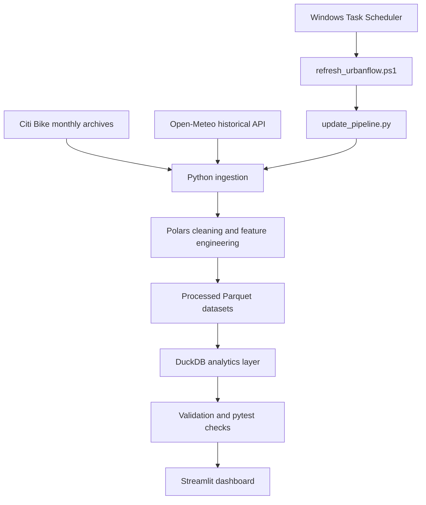

# UrbanFlow 🚲

**Urban mobility analytics for the New York City Citi Bike network**

> **Tên đề tài:** Phân tích nhu cầu di chuyển đô thị và các yếu tố ảnh hưởng bằng dữ liệu Citi Bike tại New York.

UrbanFlow is a Python data analytics and visualization project that transforms large-scale Citi Bike trip records and hourly weather observations into an interactive Streamlit dashboard. The project focuses on four analytical perspectives: overall ridership, station flow, temporal demand patterns, and weather-associated demand changes.

The current coursework release uses **August 2026** as its validated reference dataset and processes **5,244,782 Citi Bike trips** together with **744 hourly weather observations**.

---

## 1. Project goals

UrbanFlow is designed to answer practical urban-mobility questions such as:

- How does Citi Bike demand change across days and hours?
- How do weekday and weekend mobility patterns differ?
- Which stations experience the strongest rider-driven net inflow and outflow?
- Which origin-destination routes appear most frequently?
- How is demand associated with temperature and precipitation after accounting for normal weekday-hour patterns?
- Can the complete workflow—from data acquisition to dashboard refresh—be reproduced automatically?

The project is primarily a **descriptive and exploratory analytics system**. Weather relationships shown in the dashboard are associations and should not be interpreted as causal effects.

---

## 2. Data sources

### Citi Bike Trip Histories

UrbanFlow downloads monthly Citi Bike trip-history archives from the public Citi Bike/S3 data source.

Typical fields include:

- ride ID
- rideable type
- start and end timestamps
- start and end station names/IDs
- station coordinates
- member/casual rider type

Source:

- https://citibikenyc.com/system-data
- https://s3.amazonaws.com/tripdata

### Open-Meteo Historical Weather API

Hourly weather data is retrieved for New York City and includes:

- temperature
- relative humidity
- precipitation
- wind speed

The current implementation uses one city-level New York City coordinate as a weather proxy for the Citi Bike service area.

Source:

- https://archive-api.open-meteo.com/v1/archive

---

## 3. Tech stack

| Layer | Technology | Purpose |
|---|---|---|
| Language | Python 3.12+ | Core application and data pipeline |
| Package / environment management | uv | Dependency management and execution |
| HTTP ingestion | httpx | Citi Bike download and Open-Meteo API requests |
| Data processing | Polars | Cleaning, transformation and feature engineering |
| Columnar storage | Parquet / PyArrow | Efficient processed-data storage |
| Analytics database | DuckDB | Analytical views, tables and SQL queries |
| Visualization | Plotly | Interactive charts |
| Geospatial visualization | PyDeck | Station flow map |
| Dashboard | Streamlit | Interactive multi-page analytics application |
| UI layer | Streamlit + custom HTML/CSS | Consistent dashboard presentation |
| Testing | pytest | Analytics regression and quality tests |
| Code quality | Ruff | Linting and formatting checks |
| Automation | PowerShell + Windows Task Scheduler | Scheduled batch refresh |
| Version control | Git + GitHub | Source-code history and collaboration |

### Why Polars instead of Pandas?

The validated August dataset contains more than **5.2 million trips**. Polars is used as the primary DataFrame engine to make large CSV/Parquet transformations more efficient while preserving the same analytical workflow expected from tabular data processing: type conversion, filtering, cleaning, joins, aggregation and feature engineering.

---

## 4. Architecture



The automated refresh pipeline performs five main stages:

1. Resolve the requested/latest complete analysis month.
2. Acquire and process Citi Bike trip data.
3. Acquire hourly weather data.
4. Rebuild the DuckDB analytics layer and validate outputs.
5. Write refresh metadata used by the dashboard.

If the requested Citi Bike month has not yet been published, the pipeline automatically falls back to the latest available archive not later than the requested period.

---

## 5. Data-processing workflow

### Trip cleaning

The processing layer:

- parses start/end timestamps;
- standardizes station IDs as strings;
- removes records with missing ride IDs or timestamps;
- removes non-positive trip durations;
- restricts records to the active analysis month;
- derives trip duration in minutes;
- creates date, hour, weekday, day and month fields.

### Weather preparation

Hourly Open-Meteo observations are converted to a structured Parquet dataset with:

- timestamp
- date
- hour
- temperature
- relative humidity
- precipitation
- wind speed

### Analytical features

UrbanFlow derives metrics used across the dashboard, including:

- ride duration
- daily and hourly ride volume
- rider and bike-type shares
- departures and arrivals by station
- station net flow
- station imbalance ratio
- origin-destination trip counts
- expected rides by weekday-hour baseline
- demand index
- demand versus expected (%)
- precipitation categories

---

## 6. DuckDB analytics layer

The current analytics database contains the following core objects:

```text
trips
├── daily_metrics
├── hourly_metrics
├── station_metrics
├── od_flow
├── weather
└── weather_ride_hourly
```

### Key objects

- **trips** — cleaned trip-level Parquet view.
- **daily_metrics** — daily ridership aggregation.
- **hourly_metrics** — weekday/hour demand aggregation.
- **station_metrics** — arrivals, departures, activity, net flow and imbalance.
- **od_flow** — origin-destination route counts.
- **weather** — hourly historical weather.
- **weather_ride_hourly** — joined hourly mobility/weather analytical table with normalized demand metrics.

---

## 7. Dashboard

Run the Streamlit application to explore four analytical pages.

### Overview

Provides a high-level view of the active dataset:

- total rides
- median ride duration
- member share
- electric-bike share
- daily ride volume
- rider composition
- top departure stations
- analytical findings
- filtered daily-metrics CSV export

### Mobility Flow

Explores the spatial redistribution of rider demand:

- station flow map
- largest net outflow/inflow stations
- station imbalance / rebalancing pressure
- most frequent origin-destination routes

> Net station flow reflects rider trips only. Operator rebalancing movements are not included in the trip-history data, so the metric is interpreted as **rebalancing pressure**, not exact inventory change.

### Temporal Patterns

Analyzes when demand occurs:

- weekday-hour heatmap
- normalized average hourly demand
- weekday vs weekend profiles
- busiest day
- strongest recurring time slot
- commute-period patterns

### Weather Impact

Examines weather-associated demand changes after normalizing for weekday and hour:

- temperature vs adjusted demand
- precipitation vs adjusted demand
- demand by precipitation severity
- demand by temperature band
- wet-hour event analysis

These results are descriptive associations, not causal estimates.

---

## 8. Interactive controls and UI

The dashboard includes:

- rider-type filter
- bike-type filter
- date-range filter
- station activity filters on mobility views
- Plotly hover interactions
- PyDeck station map
- active dataset and last-refresh metadata
- system-health panel
- responsive custom HTML/CSS presentation
- CSV export for filtered daily metrics

The **System Health** sidebar displays indicators such as processed trip count, weather coverage, weather/mobility join coverage and available analytics objects.

---

## 9. Validated reference snapshot

The August 2026 reference build currently passes the following validation checks:

```text
Trips                  5,244,782 rows
Unique ride IDs        5,244,782
Trip date range         2026-08-01 → 2026-08-31
Positive durations      PASS
Weather observations   744 / 744 hours
Weather null values     0
DuckDB objects          7
Weather join            744 / 744 hours
Demand index mean       1.000
Station imbalance       0%–100%
```

Selected dashboard indicators for the full August 2026 dataset:

```text
Total rides             5.24M
Median ride duration    9.8 min
Member share            78.5%
Electric bike share     73.1%
```

Selected weather-adjusted descriptive results:

```text
Temperature association     +0.17
Rain association            -0.43
Dry hours vs expected       +4.2%
Wet vs dry                  -18.7 percentage points
```

---

## 10. Project structure

```text
urbanflow/
├── .streamlit/
│   └── config.toml
│
├── data/
│   ├── raw/
│   │   ├── citibike/
│   │   └── weather/
│   ├── processed/
│   │   ├── trips/
│   │   └── weather/
│   └── analytics/
│       ├── urbanflow.duckdb
│       └── refresh_metadata.json
│
├── dashboard/
│   ├── 1_Overview.py
│   ├── components/
│   │   ├── charts.py
│   │   ├── filters.py
│   │   ├── health.py
│   │   ├── kpis.py
│   │   ├── refresh.py
│   │   └── ui.py
│   └── pages/
│       ├── 2_Mobility_Flow.py
│       ├── 3_Temporal_Patterns.py
│       └── 4_Weather_Impact.py
│
├── scripts/
│   ├── download_data.py
│   ├── download_weather.py
│   ├── process_data.py
│   ├── build_database.py
│   ├── update_pipeline.py
│   ├── validate_project.py
│   └── refresh_urbanflow.ps1
│
├── src/
│   └── urbanflow/
│       ├── config.py
│       ├── ingestion/
│       ├── processing/
│       ├── analytics/
│       └── quality/
│
├── tests/
│   └── test_analytics.py
│
├── pyproject.toml
├── uv.lock
└── README.md
```

> Raw, processed and analytics datasets are intentionally excluded from Git through `.gitignore`; they can be reproduced by running the pipeline.

---

## 11. Installation

### Requirements

- Python **3.12+**
- `uv`
- internet connection for Citi Bike/Open-Meteo ingestion
- Windows PowerShell only if using the included scheduled-refresh wrapper

### Clone the repository

```powershell
git clone https://github.com/Hungnguyencode/urbanflow.git
cd urbanflow
```

### Install dependencies

```powershell
uv sync
```

---

## 12. Quick start

### Option A — build the latest available dataset automatically

```powershell
uv run python scripts\update_pipeline.py
```

The script requests the latest complete calendar month. If Citi Bike has not yet published that month, the pipeline automatically selects the latest available archive.

### Option B — reproduce the August 2026 reference build

```powershell
uv run python scripts\update_pipeline.py --period 202608
```

### Remove raw ZIP/CSV files after a successful refresh

```powershell
uv run python scripts\update_pipeline.py --period 202608 --cleanup-raw
```

### Force a full re-download/rebuild

```powershell
uv run python scripts\update_pipeline.py --period 202608 --force
```

### Start the dashboard

```powershell
uv run streamlit run dashboard\1_Overview.py
```

Streamlit will print a local URL, typically similar to:

```text
http://localhost:8501
```

---

## 13. Running individual pipeline stages

The end-to-end orchestrator is recommended for normal usage, but individual stages can also be executed separately.

```powershell
uv run python scripts\download_data.py --period 202608
uv run python scripts\process_data.py --period 202608
uv run python scripts\download_weather.py --period 202608
uv run python scripts\build_database.py --period 202608
uv run python scripts\validate_project.py --period 202608
```

---

## 14. Validation and testing

### Project validation

```powershell
uv run python scripts\validate_project.py --period 202608
```

The validator checks file availability, trip uniqueness/date coverage/duration validity, hourly weather completeness, DuckDB period consistency, weather joins, normalized demand index and station imbalance bounds.

### Unit / analytics tests

```powershell
uv run pytest -q
```

The current reference build contains **10 passing analytics tests**, including checks for:

- required DuckDB objects
- expected trip count
- unique ride IDs
- August 2026 date range
- positive ride durations
- complete hourly weather coverage
- complete weather/ride join
- normalized demand index
- valid station imbalance ratio
- non-negative station activity

### Linting

```powershell
uv run ruff check .
```

---

## 15. Automatic refresh

UrbanFlow includes a PowerShell wrapper for scheduled batch refreshes:

```powershell
powershell -ExecutionPolicy Bypass -File scripts\refresh_urbanflow.ps1
```

To refresh a specific period:

```powershell
powershell -ExecutionPolicy Bypass -File scripts\refresh_urbanflow.ps1 -Period 202608
```

The wrapper:

- changes into the project directory;
- enables UTF-8 console/Python output;
- runs the automatic pipeline with raw-data cleanup;
- records the process exit code;
- writes timestamped refresh logs under `logs/`.

It can be registered with **Windows Task Scheduler** for recurring execution. The current coursework setup uses a scheduled batch refresh; the schedule itself is machine-local and is not stored in Git.

---

## 16. Refresh metadata and cache synchronization

After a successful pipeline run, UrbanFlow writes:

```text
data/analytics/refresh_metadata.json
```

Metadata includes:

- requested period
- actual active period
- last refresh timestamp
- trip Parquet path
- weather Parquet path
- DuckDB path

The Streamlit application reads this metadata to display the active period/last refresh and to invalidate cached data when the dataset version changes.

---

## 17. Reproducibility and data-quality philosophy

UrbanFlow separates the workflow into reproducible stages rather than embedding all processing inside the dashboard.

```text
Source data
   ↓
Ingestion
   ↓
Cleaning / feature engineering
   ↓
Parquet
   ↓
DuckDB analytics
   ↓
Validation / tests
   ↓
Dashboard
```

This design provides several practical benefits:

- raw downloads and dashboard rendering are decoupled;
- processed Parquet files can be reused;
- the analytical database can be rebuilt deterministically;
- validation runs before refresh metadata is published;
- cached dashboard data can be synchronized with a new dataset;
- large raw source files do not need to be committed to Git.

---

## 18. Known limitations

- The current release analyzes monthly **historical** Citi Bike trip data rather than real-time station feeds.
- The validated reference snapshot covers **August 2026**; the pipeline is period-aware, but the test suite contains August-specific regression expectations for this release.
- Historical weather is represented by a **single New York City reference location**, so it approximates city-level conditions rather than station-specific microclimates.
- Weather results are **descriptive associations**, not causal estimates.
- Rider trip flow does not include Citi Bike operator rebalancing movements.
- Windows Task Scheduler automation is local to the machine on which the task is configured.
- Raw/processed/analytics data are excluded from Git and must be generated locally.

---

## 19. Possible future work

UrbanFlow V1 is intentionally scoped as a coursework analytics/dashboard project. Potential extensions include:

- multi-month incremental ingestion and partitioned storage;
- containerization with Docker;
- portable workflow orchestration;
- CI checks for tests/linting/data contracts;
- Citi Bike GBFS near-real-time station monitoring;
- live availability maps and time-series monitoring;
- station-level demand/imbalance forecasting.

These are roadmap ideas rather than features of the current release.

---

## 20. Coursework mapping

UrbanFlow follows the six-step data-visualization workflow used in the course assignment:

| Course step | UrbanFlow implementation |
|---|---|
| 1. Define requirements | Urban mobility questions covering demand, time, station flow and weather |
| 2. Collect data | Python ingestion from Citi Bike archives and Open-Meteo API |
| 3. Clean and combine | Polars cleaning, normalization, weather-trip integration |
| 4. Create features and metrics | Duration, temporal fields, net flow, imbalance, demand index, precipitation classes |
| 5. Visualize with Python | Plotly and PyDeck |
| 6. Automatic dashboard | Streamlit dashboard + periodic refresh pipeline |

---

## 21. Author

**Hungnguyencode**

GitHub: https://github.com/Hungnguyencode

---

## Project status

**UrbanFlow V1 — coursework release**

Validated reference build:

```text
Ruff       PASS
pytest     10 passed
Validator  ALL CHECKS PASSED
```

The V1 codebase is considered feature-complete for the course submission and serves as a baseline for future engineering extensions.
