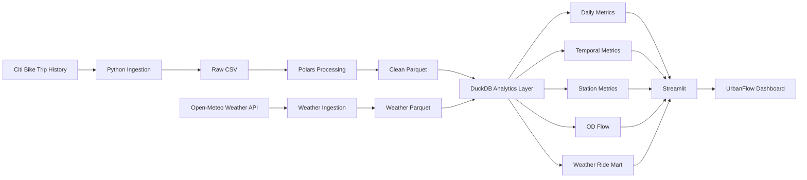

# 🚲 UrbanFlow

**Urban Mobility Analytics & Visualization Platform**

UrbanFlow is an end-to-end data visualization project that explores
Citi Bike mobility patterns across New York City using more than
**5.24 million bike trips from August 2026**.

The project combines mobility data with historical weather observations
to analyze temporal demand, station flow imbalance, rider behavior,
and weather-related demand patterns.

---

## ✨ Project Highlights

- Processed **5.24M Citi Bike rides**
- Reduced raw CSV data from ~1 GB to ~188 MB using Parquet
- Built a reproducible analytics pipeline with **Polars + DuckDB**
- Resolved multiple source station IDs into canonical station entities
- Adjusted temporal analysis to avoid weekday-frequency bias
- Joined **744 hourly weather observations** with hourly mobility demand
- Built an interactive multi-page dashboard using **Streamlit**
- Visualized station-level geographic flow using **PyDeck**

---

## 📊 Dashboard

UrbanFlow contains four analytical views:

### Overview

Provides key metrics and high-level mobility patterns:

- Total rides
- Median ride duration
- Member share
- Electric bike share
- Daily demand trends
- Top departure stations

### Mobility Flow

Analyzes how rider trips redistribute bikes across the network:

- Station activity map
- Net bike inflow and outflow
- Station imbalance ratio
- High-pressure stations
- Most frequent origin-destination routes

### Temporal Patterns

Explores when Citi Bike demand occurs:

- Weekday × hour heatmap
- Average hourly demand
- Average demand by day of week
- Weekday vs weekend behavioral patterns

### Weather Impact

Explores associations between weather and mobility demand:

- Temperature association
- Precipitation association
- Weather-adjusted demand
- Precipitation severity
- Temperature bands

Weather analysis is adjusted using weekday × hour demand baselines
to reduce temporal confounding.

---

## 🏗️ Architecture



---

## 🧱 Data Pipeline

```text
Citi Bike S3
      ↓
Raw ZIP / CSV
      ↓
Data profiling
      ↓
Polars cleaning
      ↓
Parquet
      ↓
DuckDB
      ↓
Analytics marts
      ↓
Streamlit / Plotly / PyDeck
```

Weather pipeline:

```text
Open-Meteo API
      ↓
Hourly weather
      ↓
Parquet
      ↓
DuckDB
      ↓
weekday × hour normalization
      ↓
Weather analytics
```

---

## 🛠️ Tech Stack

| Layer | Technology |
|---|---|
| Language | Python |
| Package management | uv |
| Data processing | Polars |
| Storage format | Parquet |
| Analytical database | DuckDB |
| Dashboard | Streamlit |
| Charts | Plotly |
| Geographic visualization | PyDeck |
| HTTP ingestion | httpx |
| Testing / quality | pytest, Ruff |
| Version control | Git |

---

## 📂 Project Structure

```text
urbanflow/
│
├── dashboard/
│   ├── 1_Overview.py
│   └── pages/
│       ├── 2_Mobility_Flow.py
│       ├── 3_Temporal_Patterns.py
│       └── 4_Weather_Impact.py
│
├── data/
│   ├── raw/
│   ├── processed/
│   └── analytics/
│
├── scripts/
│   ├── download_data.py
│   ├── download_weather.py
│   ├── profile_data.py
│   ├── profile_duration.py
│   ├── process_data.py
│   └── build_database.py
│
├── src/
│   └── urbanflow/
│       ├── ingestion/
│       ├── processing/
│       ├── analytics/
│       └── quality/
│
├── tests/
├── notebooks/
├── pyproject.toml
├── uv.lock
└── README.md
```

---

## 🚀 Running the Project

### 1. Clone the repository

```bash
git clone <repository-url>
cd urbanflow
```

### 2. Install dependencies

```bash
uv sync
```

### 3. Download Citi Bike data

```bash
uv run python scripts/download_data.py
```

### 4. Profile the raw dataset

```bash
uv run python scripts/profile_data.py
```

### 5. Process trips into Parquet

```bash
uv run python scripts/process_data.py
```

### 6. Download historical weather

```bash
uv run python scripts/download_weather.py
```

### 7. Build the analytics database

```bash
uv run python scripts/build_database.py
```

### 8. Start UrbanFlow

```bash
uv run streamlit run dashboard/1_Overview.py
```

---

## 🔎 Data Quality

The pipeline validates:

- Duplicate ride IDs
- Missing timestamps
- Invalid trip duration
- Invalid coordinates
- Missing station information
- Monthly dataset boundaries
- Weather timestamp coverage
- Weather null values
- Analytics join completeness

Station identifiers are normalized at the analytical layer because a
physical Citi Bike station may appear under multiple source station IDs.

---

## 📈 Key Findings

### Temporal behavior

Weekday demand exhibits a commuter-oriented pattern with peaks around
the morning and evening rush hours.

Weekend demand shifts toward midday and afternoon usage.

### Rider composition

Approximately **78.5%** of analyzed rides were made by Citi Bike members.

### Bike type

Approximately **73.1%** of rides used electric bikes.

### Weather

After adjusting for weekday and hour:

- Dry hours averaged approximately **4.2% above expected demand**
- Light precipitation averaged approximately **10.8% below expected demand**
- Moderate/heavy precipitation averaged approximately **39.1% below expected demand**

These patterns describe associations and should not be interpreted as
causal effects.

---

## ⚠️ Limitations

- The analysis currently covers only August 2026.
- Weather is represented using one New York City reference location.
- Citi Bike trip history does not contain operator rebalancing movements.
- Station flow therefore represents rider-driven flow rather than exact
  station inventory changes.
- Weather normalization uses a one-month weekday × hour baseline.

---

## 🔮 Future Development

Possible extensions include:

- Multi-month / multi-year analysis
- Automated orchestration with Airflow
- Real-time Citi Bike GBFS ingestion
- Kafka / Redpanda streaming
- ClickHouse analytics serving
- Station demand forecasting
- MLflow model lifecycle
- Real-time station rebalancing alerts

---

## 📌 Data Sources

- Citi Bike Trip History
- Open-Meteo Historical Weather

---

## 👤 Author

**Hung Nguyen**

Data Engineering / Analytics Engineering Project